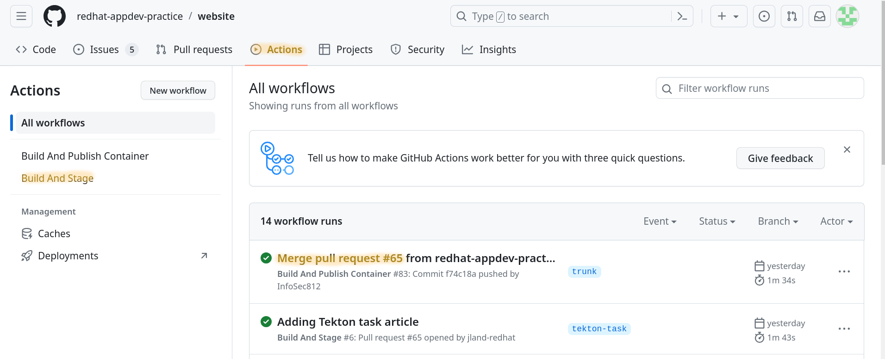

# This is a [VuePress](https://vuepress.vuejs.org/) site for [Cloud-Native AppDev](https://appdev.consulting.redhat.com/)

## Prerequisites

* NodeJS >= 12
* NPM >= 6
* Git
* A Modern Browser
* (OPTIONAL) An editor with support for Markdown

## Introduction

[](.assets/thumbnails/CodeIntro.png)

The website appdev.consulting.redhat.com is an initiative undertaken by consultants from the AppDev Community of Practice (CoP). Its purpose is to provide practical examples of various technologies and techniques that can greatly benefit our clients and fellow consultants. These examples cover areas not directly addressed by the official Red Hat learning resources.

This platform enables the creation of uncomplicated and free lab exercises. These labs serve as valuable tools to assist customers in comprehending different technologies. Furthermore, they contribute to raising awareness about the services offered by Red Hat's organization.

### Why Should I Contribute

Contributing content, such as videos, to this project offers more than just the act of giving back. It presents several additional advantages.

Firstly, the platform offers a safe space to practice public speaking and technical topic presentations. This practice occurs in a controlled setting without the pressure of a live audience.

Secondly, your involvement will enhance your personal brand. Not only will your contributions be visible to those within Red Hat, but they will also be accessible to the wider audience utilizing our website.

### What Can I Contribute

The biggest contribution you can make is more content. We want you to create content on technologies you are passionate about! We do have guidelines as to help make sure our site has a coherient feel and more info on what accept can be found [below](#creating-a-new-article)

But if you do not have the time or are not yet comfortable contributing an entire article we are more than happy to take other contributions such as:

* Grammar/Spelling mistake fixes
* Improved tooling to help with
  * Website look/feel
  * Developer or DevOps tooling

## Creating Content

Our [Journey Map](https://lucid.app/documents/embeddedchart/74fe4c6a-a778-4b96-961a-2af86a36326e) serves as our guiding compass for determining the upcoming content we intend to develop. While we remain open to receiving videos that don't directly align with our journey map, the Cloud Native AppDev Enablement team places significant emphasis on ensuring that any content created resonates with our brand identity.

Should you choose to craft content and wish to have it considered, we kindly request that you share it within our [Google Chat](https://chat.google.com/room/AAAAyFv-1vU?cls=4) channel before starting. This step is crucial in ensuring that we are all in agreement and aligned before moving forward. Your collaboration in this process is greatly appreciated.

## Content Guidelines

The Cloud Native AppDev Enablement Team has a few guiding principles we like to follow when creating content

### Consumable

We want our content to be short and sweet. Optimally these are labs and videos that a consultant or client could look at on their lunch break and make it through. The rule of thumb for the videos that we release on our youtube channel is that they run around 20 minutes give or take a couple minutes.

### Red Hat Technology Adjacent

The Cloud Native AppDev Enablement Team is not attempting to compete with Red Hat Learning. The subjects we cover may have some overlap with our internal training but should not be focused directly on a Red Hat product. Rather we want to talk about ways to empower our customers with other open source tools and practices that our Services have found useful in the past.

### Technical and Demoable

The Cloud Native AppDev Enablement Team wants to aim this platform at technical resources. While we encourage basic explications at the start of a video or lab, we also want to make sure that users are able to try out the subject that you are attempting to explain.

## Adding a New Text Lab

Below are the technical details for creating and validating your text article on the website.

### Useful Links

A set of useful links when writing articles or making changes to this repository

* [Markdown](https://www.markdownguide.org/basic-syntax/) is the techincal writing language used
* [VuePress](https://vuepress.vuejs.org/guide/getting-started.html) is how we are generating our site
  * [Custom Containers](https://vuepress.vuejs.org/guide/markdown.html#custom-containers) are a useful trick to know

### Run the Site on Your Local Machine

* Clone this repository
* Navigate to the `src` directory (if you see this README on your website you are in the wrong directory)
* Run `npx vuepress dev --no-cache`
* Navigate to [http://localhost:8080/](http://localhost:8080/) in a browser

> **Note:** Depending on your version of node you may need to set the openssl-legacy-provider option so use this command: `NODE_OPTIONS=--openssl-legacy-provider npx vuepress dev --no-cache`

### Creating New Articles

[](.assets/thumbnails/contributing.png)

To create a new article first create a new markdown(.md) file inside of `src/tracks/<TRACK FOLDER>`

Every new article should start with some basic [frontmatter](https://vuepress.vuejs.org/guide/frontmatter.html). Frontmatter is a TOML block at the top of your markdown file which allows you to set some additional metadata about your document.

  ```markdown
  ---
  title: Behavior-Driven Development
  collasable: true
  tags:
  - gherkin
  - bdd
  - behavior
  - behaviour
  - behavior-driven
  - behaviour-driven
  ---

  # Behavior-Driven Development  // Markdown starts here
  ```

> **Tip** The site(and search) is indexed based on this metadata. So the better your metadata is the more likely people are to find your article

And an example article body should look something like this:

  ```markdown
  # My Article Title

  [[toc]]

  ## Video
  <!-- Embedded Video -->

  ## Introduction
  <!-- Short introduction of the topic -->

  ## Lab Instructions

  ### Prerequisites
  <!-- Prereqs if any -->

  ### Section 1

  ### Section 2

  ## Wrap Up
  <!-- What did this lab show, next steps (sometimes we create an "extra credit" section with additional unguided challenges) -->
  ```

### Update the Navigation

It is important that once you have created your article you also update the navigation so users are able to find it

* Open the `src/.vuepress/config.js` **AND** `src/.vuepress/config-staging.js` file
* Locate the `sidebar` key under `themeConfig`
* Locate `children` key beneath `Tracks`
* Locate the child for the track you wish to expand
* Add a new entry to the `children`

  ```javascript
          {
            title: 'Developer Tools',
            path: '/tracks/devtools/',
            collapsable: true,
            sidebarDepth: -1,
            initialOpenGroupIndex: -1,
            children: [
              '/tracks/devtools/owasp-dependency-check',
              '/tracks/devtools/owasp-zap-hud',
              '/tracks/devtools/npm-audit-ci-wrapper',
              '/tracks/devtools/my-new-devtool-article'  // <== Like this!
            ]
          }
  ```

> **Note:** If required a new section can be created by adding another json object to the list of `Tracks`

### Publishing this site

#### Local Validation

Before creating a Merge Request please run and validate there are no errors:
`yarn install: yarn build`

> **Note:** as mentioned above may need to modify the build to `NODE_OPTIONS=--openssl-legacy-provider yarn build`

It is also a good idea to validate the docker image is building correctly:

```sh
docker build -t cloudnative-local:latest .
docker run  -p 127.0.0.1:80:8080/tcp cloudnative-local:latest
```

Make sure to visit the site at `127.0.0.1`, and validate you are able to navigate to your article and everything looks as expected.

#### Staging

Once local validation is completed a version of the website should be automatically deployed to our staging environment through a [github workflow](.github/workflows/stage.yaml). Once the deployment is completed a comment with the pages url will be added to your merge request. Please validate against the staging environment as well to make sure everything looks good.

If the staging environment is not being updated properly, then validate the workflow ran successfully by navigating to `Actions -> Build and Stage` and finding the job associated with your MR:



#### Approval

Once you feel like your article is ready for review please post in the [Google Chat Channel](https://chat.google.com/room/AAAAyFv-1vU?cls=4) and ask for a reviewer. If our reviewers do not find any issues we will merge your branch with the `trunk`

#### Final Publish

Once merged with `trunk` a [GitHub Actions](.github/workflows/containerize.yml) has been created to publish an image with the new site to `quay.io/cloud-native-runtimes/cnad-vuepress:latest`.

Once this job runs successfully there is a cron job that runs periodicity on the consulting GitHub that actually publishes out the site.

If you do not see your changes being published within about an hour of the merge then run through the following steps:

1. Verify the [build](https://github.com/redhat-appdev-practice/redhat-appdev-practice.github.io/actions) was successful
1. Validate the latest `quay.io/cloud-native-runtimes/cnad-vuepress` image is correct
   * Pull the latest image and validate the `CREATED` date makes sense
   * Run the image using docker and make sure you are able see your changes
  [](https://asciinema.org/a/601732)
1. If the latest image does not match with what is on [https://appdev.consulting.redhat.com/](https://appdev.consulting.redhat.com/), then please ping the admins in the `Consulting Gitlab Channel` (This channel is not public but most of the consultants are in it by default, if you can't find it ping someone on our channel)

### Congrats!!!

You have uploaded new content to our site! In a few months Google Analytics can tell us just how popular you are!

### Article Writing Tips and Tricks

#### Adding images

[Images](https://vuepress.vuejs.org/guide/assets.html#public-files) can be placed in `src/.vuepress/public/` and everything in that directory will be relative to the web root. For example, if you place an image in `src/.vuepress/public/devtools/my-cool-image.svg`, then it's relative path would be `https://<site>/devtools/my-cool-image.svg` and it could be referenced in your markdown with ``

### Adding asciinema recordings/playback

[ASCIInema](https://asciinema.org/) is a great tool for recording command-line screencasts which remain "just text" and as such have the following benefits:

* You can copy and paste content from the cast
* It's more accessible to people with visual impairment
* It's lighter than a video stream

1. Add your `cast` file to the `src/.vuepress/public/casts` folder
1. Add the **asciinema** component to your page

   ```asciidoc
   <asciinema :src="$withBase('/casts/my-recording.cast')" cols=120 rows=30 />
   ```

#### Known Issues

I trying to use `{{ }}` in your article it must be escaped, see the helm-intro project or [here](https://vuepress.vuejs.org/guide/using-vue.html#escaping)

## Adding a new Video to YouTube

If possible the Cloud Native AppDev Enablement team try to match our written content with a video component, although we may accept just written labs or just videos depending on the subject.

As mentioned in our guidelines videos should be around 20 minutes in length and meet a few other criteria:

* Clear Audio
  * Reduce background noise when recording
  * Use as high quality a mic as you have access too.
* Clear Screen Capture
  * Screen should be readable
  * When doing any recording or post work try to capture video in at least 1080p
  * We encourage you to be on screen but do not block your work
* Hide your information!
  * Remember these are public, it is recommended you limit the content you are sharing on screen to what is relevant for the topic
  * Using a dedicated browser profile for recording is a good idea

### Recommended Tools

#### Video Capture

[OBS](https://obsproject.com/) is the gold standard in opensource video recording.

#### Video Editing

While some of our members are able to capture the video in a single shot, minor post work can be useful for cutting out long silences are small mistakes. It can also be used to break the recording up into multiple sessions although this will normally increase the overall time and effort it takes to complete the video.

[Openshot](https://www.openshot.org/) is a very easy to use opensource editing software.

### Uploading your Video

If this is your first video please ask someone in our [Google Chat](https://chat.google.com/room/AAAAyFv-1vU?cls=4) to do the upload with a link to the raw video on Google Drive. We may also give direct access if you become a regular contributor.

## Other Contributions

If you would like to submit a pull against this repository and have it count toward Hacktoberfest, please be aware that this is what we are looking for:

* Improvements to one of the existing track pages:
  * Better or more idomatic workflow (Subjective and at the discretion of our team to decide if wanted)
  * Fixes to spelling
  * Updated or improved tooling
* New track pages which align with our [Journey Map](https://lucid.app/documents/embeddedchart/74fe4c6a-a778-4b96-961a-2af86a36326e)

In order to avoid wasting your time and ours, it is recommended that you submit an issue describing your contribution first.

**Thank you! And happy hacking!!**

## Other Recommendations

This section is for folks to recommend tools they find useful.

### VS Code Plugins

- [Markdown Linter](https://marketplace.visualstudio.com/items?itemName=DavidAnson.vscode-markdownlint)
- 