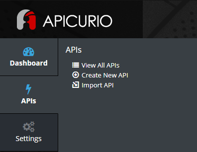
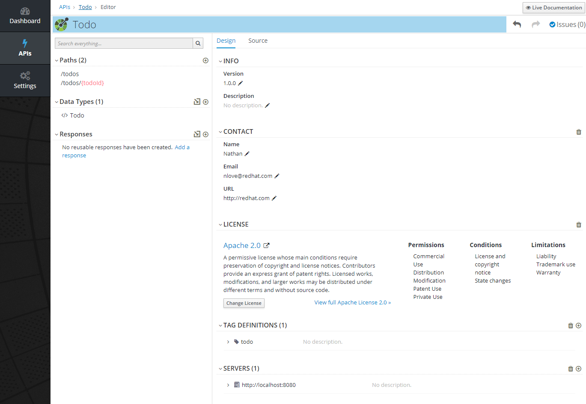
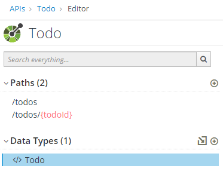
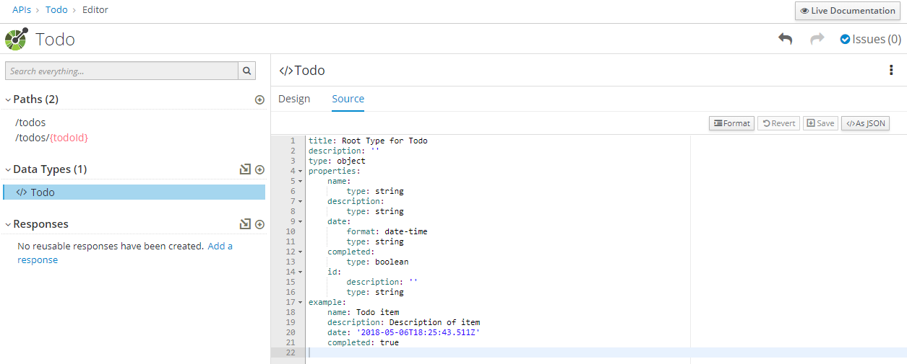
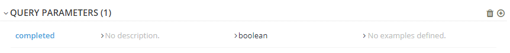
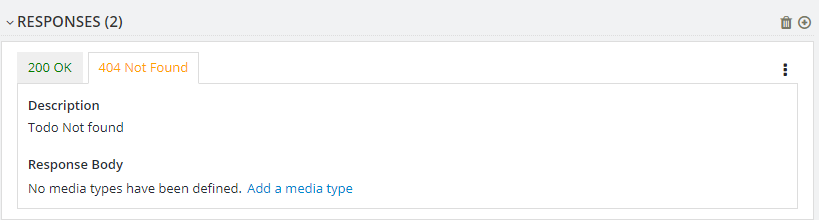
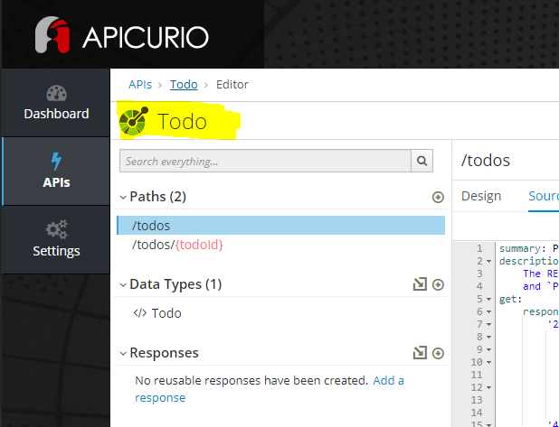
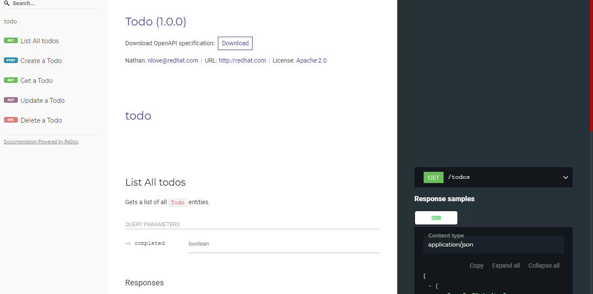

# Introduction to OpenAPI with Apicurio

## Video
<iframe width="560" height="315" src="https://www.youtube.com/embed/byXzRsh5TXE" frameborder="0" allow="accelerometer; autoplay; clipboard-write; encrypted-media; gyroscope; picture-in-picture" allowfullscreen></iframe>

## Katacoda Scenario

[Try this out on Katacoda](https://katacoda.com/natelove/scenarios/apicurio)

## Lab Instructions

In this lab we will look at managing an OpenAPI spec using Apicurio.

1. Open a web browser and navigate to https://www.apicur.io/
1. Select the `Try Live` button
1. Login using preferred method
1. Select APIs on the left and select `Create New API` in the sub menu
   
1. Enter a name and description for the new API
1. Select `Blank API` for the template and click `Create API`
1. This will take you to the landing page for your new API, at this point we are going to click `Edit API`
1. Update the Contact and License info in the Design tab
1. Add a default Tag Definition of todo
1. Select the `add a server` option under the Servers section. Set the Server URL to be localhost:8080
1. The completed design tab should look similar to this:
   
1. Click on the `+` button next to `Data Types` to add a new data type to the API
1. Enter `Todo` for the Name, and for the JSON example paste the following:
    ```json
        {
            "name": "Todo item",
            "description": "Description of item",
            "date": "2018-05-06T18:25:43.511Z",
            "completed": true
        }
    ```
1. Under the `Choose to create a REST Resource` section, select the `REST Resource` option and click `Save`
    ::: tip
    Two paths have been automatically generated for the new Todo data type
    :::
    
1. Select the Todo data type
1. Under `Properties` in the Design tab, select the `+` button
1. Add a new property for an id by typing `id` in the Name field
1. Under the `Enter Type Information` section, set the Property to be `Not Required` and of type `String`, click `save`
1. Select the `Source` tab to view the yaml source of the Todo type, note the added id property
   
1. Under the `/todos` path, select the GET operation, click the `+` icon under the Query Parameters section
1. The name of the parameter should be set to `completed`, this parameter should not be required and is of type `Boolean`
1. Click save, note that the new parameter has been added in the design tab
   
1. Under the `Responses` section, select the `+` button to add a new response
1. Select `404 Not Found` from the drop down menu and click `Add`
   
1. Edit the Description of the new response to `Todo not found`
1. To view the generated OpenAPI spec source code, click `TODO` in the top left next to the green circle icon, this
takes you to the root of your API
   
1. Select the `Source` tab
1. At any time if you would like to view the autogenerated redoc Documentation, click `Live Documentation` in the top right
   
